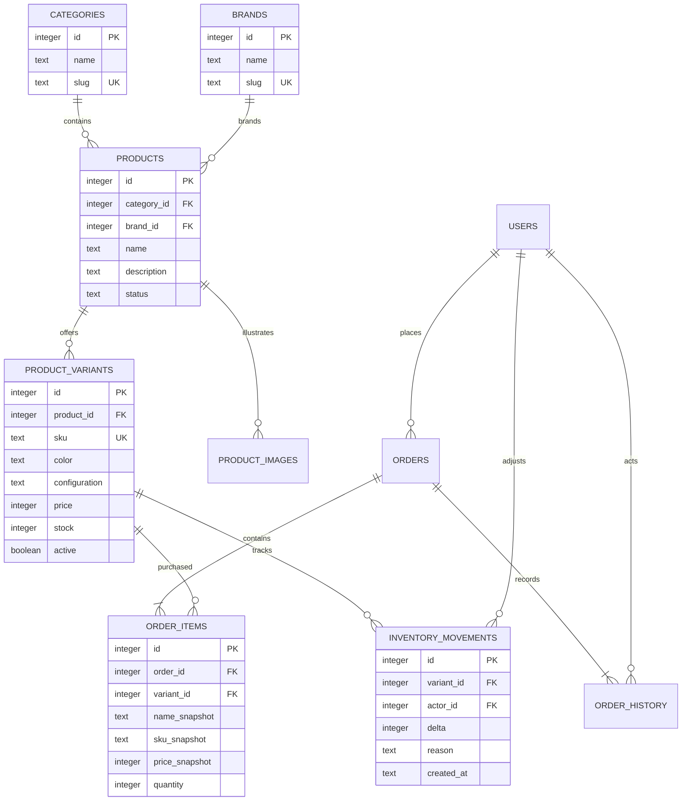

# ERD đề xuất cho catalog và đơn hàng

> ERD sơ bộ giữ làm lịch sử. Được thay thế cho thiết kế mục tiêu bởi [07_ERD_VA_TU_DIEN_DU_LIEU.md](07_ERD_VA_TU_DIEN_DU_LIEU.md): mô hình đủ tài khoản, catalog/SKU, giỏ, đơn, tồn kho, khuyến mãi, thanh toán, vận chuyển, đánh giá, hỗ trợ, audit và tích hợp. Các quy tắc stock/price tại bản sơ bộ không thay thế mô hình on_hand/reserved và giá nháp nullable ở bản mới.

Ngày: 05/10/2026. Đây là mô hình mục tiêu cho bước chuẩn hóa SKU, chưa thay đổi SQLite hiện tại. Các module khuyến mãi, đánh giá, hỗ trợ và tích hợp sẽ được mở rộng sau khi đặc tả nghiệp vụ.

## Ràng buộc và dữ liệu

- Tiền là số nguyên VND; giá > 0; tồn >= 0; số lượng mua 1–99. SKU và slug unique; khóa ngoại bật.
- Sản phẩm có trạng thái DRAFT/ACTIVE/HIDDEN. Không công bố nếu không có SKU đang bán và giá hợp lệ; chỉ ADMIN thiết lập giá SKU.
- Không xóa SKU/sản phẩm đã có đơn; ẩn để bảo toàn lịch sử. Chi tiết đơn giữ tên, mã SKU, cấu hình và giá lúc mua.
- Điều chỉnh tồn, tạo đơn và hủy đơn ghi inventory_movements trong cùng giao dịch; hoàn tồn tối đa một lần.
- order_history giữ actor, trạng thái cũ/mới, thời gian. Đơn, thanh toán và vận chuyển cần trạng thái độc lập.
- Thêm index cho products(category_id, brand_id), order_items(order_id), orders(user_id, created_at), order_history(order_id), inventory_movements(variant_id, created_at).
- Khóa idempotency của checkout lưu CSDL với UNIQUE(user_id, request_key), gắn đơn và dấu vân tay dữ liệu yêu cầu; yêu cầu lặp trả đơn cũ, cùng khóa khác nội dung bị từ chối.

## Migration từ bản hiện tại

1. Sao lưu và kiểm tra khôi phục CSDL; thêm bảng migration có phiên bản.
2. Tách giá trị danh mục/thương hiệu hiện có thành bảng; chuẩn hóa tên và xử lý trùng trước khi thêm unique.
3. Mỗi sản phẩm hiện có tạo một SKU mặc định, giữ nguyên giá/tồn; ánh xạ order_items hiện có sang SKU này, giữ snapshot cũ.
4. Đổi giỏ hàng từ product_id sang variant_id; phiên cũ phải được chuyển đổi hoặc thông báo xóa giỏ rõ ràng.
5. Kiểm tra tổng đơn và tồn trước/sau; chạy giao dịch kiểm thử đặt/hủy. Không tự seed lại dữ liệu thật.

Chưa coi tài liệu này là ERD toàn bộ hệ thống: còn cần schema chi tiết users/addresses, sessions, payments/events, shipments, promotions/redemptions, reviews, support_requests, audit_logs và thuộc tính kỹ thuật theo danh mục.
