# Quy tắc nghiệp vụ và sơ đồ luồng

Phiên bản 1.0 — 05/10/2026. Các lựa chọn ngoài quyền giá là giả định thiết kế tại [README](README.md). Tất cả thời điểm lưu UTC, hiển thị Asia/Saigon. Dưới đây là thiết kế mục tiêu, khác với bản COD hiện tại ở cách giữ tồn và ghi nhận tiền.

## 1. Quy tắc

| Mã | Quy tắc |
|---|---|
| BR-01 | CUSTOMER chỉ thao tác dữ liệu mình; N/Q dùng tài khoản khách riêng khi mua. Khóa tài khoản vô hiệu hóa phiên qua auth_version. |
| BR-02 | STAFF tạo DRAFT/SKU inactive không giá, sửa thông tin/tồn; chỉ ADMIN đặt giá và công bố/ẩn. SKU active phải có giá > 0. |
| BR-03 | available = on_hand - reserved. Đặt đơn tăng reserved; hủy/hết hạn trước giao giảm reserved; bàn giao giảm cả on_hand và reserved; hàng thực về tăng on_hand. Tất cả nguyên tử và có movement. |
| BR-04 | Server tính subtotal, discount và phí; total = subtotal - discount + shipping_fee. Bản đầu không hỗ trợ đơn miễn phí: tổng giảm tối đa subtotal-1 VND, luôn total>0. Snapshot tên/SKU/cấu hình/giá/địa chỉ/khuyến mãi/phí không đổi sau tạo đơn. Báo giá đổi phải xác nhận lại. |
| BR-05 | Checkout UNIQUE(user_id,request_key); cùng nội dung trả đơn cũ, khác nội dung bị conflict. Callback UNIQUE(provider,event_id); trạng thái terminal không đảo ngược bởi event cũ. |
| BR-06 | CUSTOMER hủy PENDING; N/Q hủy PENDING/CONFIRMED/PREPARING. SHIPPING không hủy trực tiếp. PAID hủy phải REFUND_PENDING, không giả định đã hoàn. |
| BR-07 | COD có thể xác nhận khi UNPAID; ONLINE phải PAID mới CONFIRMED. ONLINE PENDING chưa thu hết hạn 15 phút thì CANCELLED và giải phóng giữ tồn; thời hạn cấu hình. |
| BR-08 | Callback success muộn ghi nhận tiền nhưng không mở lại đơn; REFUND_PENDING và ngoại lệ cho ADMIN. Callback thất bại sau success không lùi PAID. |
| BR-09 | Tạo vận đơn chưa phải giao hàng. SHIPPING chỉ khi bàn giao thực tế; DELIVERED chưa phải thu COD. Giao thất bại chưa cộng kho; nhận lại hàng rồi mới cộng. |
| BR-10 | Một mã/đơn; FIXED hoặc PERCENT 1–100 có trần; thời gian [start,end), minimum theo subtotal; phạm vi PRODUCT hoặc ALL; không giảm phí ship. Lượt HELD+USED tính vào limit. Hủy trước bàn giao → RELEASED; bàn giao → USED; đơn thất bại sau bàn giao không tự phục hồi lượt. |
| BR-11 | Một review/order_item; chủ đơn DELIVERED, 1–5 sao; chỉ APPROVED hiển thị/tính trung bình. Sửa lại phải duyệt lại. |
| BR-12 | Doanh thu hàng ghi nhận khi đơn DELIVERED và payment PAID: subtotal-discount, không gồm ship. recognition_at là thời điểm điều kiện cuối đạt. Tiền thu/hoàn dựa ledger SUCCEEDED theo occurred_at. Báo cáo net cash = thu - hoàn gồm ship; không gọi net cash là lợi nhuận. |
| BR-13 | Không xóa giao dịch/đối tượng được tham chiếu; ẩn/khóa. Audit ghi người/nguồn, thời gian, lý do, trước/sau đã che nhạy cảm; không cung cấp chức năng sửa/xóa. |
| BR-14 | So sánh tối đa 3 SKU cùng danh mục; thông số có kiểu và đơn vị. Gợi ý không ML: cùng danh mục +50, cùng thương hiệu +20, giá lệch <=20% +10; tie-break lượng đã giao giảm dần rồi ID. |
| BR-15 | Một đơn một shipment. Phí theo shipping_rate áp cho địa bàn, trọng lượng và hiệu lực; chưa có biểu phí thực thì không nhận checkout ở địa bàn chưa cấu hình. Không ngầm miễn phí ngoài demo. |
| BR-16 | Tác vụ nền và API ngoài dùng job bền vững; retry giữ request_key. Timeout là chưa rõ kết quả, phải tra cứu/retry cùng tham chiếu trước khi tạo yêu cầu mới. |

## 2. Ma trận chuyển trạng thái

### Đơn hàng

| Từ | Sang | Nguồn/điều kiện | Tồn/tiền |
|---|---|---|---|
| Mới | PENDING | UC-18 | Giữ tồn; giữ lượt mã |
| PENDING | CONFIRMED | N/Q; COD hoặc ONLINE PAID | Không đổi tồn |
| CONFIRMED | PREPARING | N/Q | Không đổi tồn |
| PREPARING | SHIPPING | UC-26 bàn giao có vận đơn | Tiêu thụ reservation; lượt mã USED |
| SHIPPING | DELIVERED | G xác thực hoặc N/Q thủ công | Không tự thu COD |
| PENDING | CANCELLED | Chủ đơn, N/Q hoặc hết hạn ONLINE chưa thu | Giải phóng giữ; hoàn tiền nếu có |
| CONFIRMED/PREPARING | CANCELLED | N/Q; chưa bàn giao | Giải phóng giữ; hoàn tiền nếu có |
| SHIPPING | DELIVERY_FAILED | Đã nhận lại hàng, shipment RETURNED | Cộng kho một lần; tiền thu cần hoàn |

CANCELLED/DELIVERED/DELIVERY_FAILED là terminal trong phạm vi này. Đổi trả sau giao thuộc mở rộng. Không sửa tay trạng thái để vượt điều kiện.

### Thanh toán đơn và attempt

- Đơn: UNPAID → PENDING khi tạo attempt ONLINE; PENDING → PAID khi verified success; PENDING → UNPAID khi FAILED/hết hạn mà chưa thu; UNPAID/PENDING → REFUND_PENDING nếu tiền success đến khi đơn đã hủy; PAID → REFUND_PENDING khi hủy/giao thất bại; REFUND_PENDING → REFUNDED khi hoàn đủ.
- COD: UNPAID → PAID chỉ qua UC-24. Hủy COD chưa thu giữ UNPAID.
- Attempt: CREATED → PENDING → SUCCEEDED/FAILED; CREATED/PENDING → EXPIRED khi quá hạn. Verified success muộn từ FAILED/EXPIRED vẫn ghi SUCCEEDED và xử lý ngoại lệ, vì tiền thật có thể đã thu; không suy luận thành công từ trang redirect.
- payment_exception ghi nghĩa vụ hoàn của khoản thu muộn/trùng. Nếu đơn hợp lệ đã PAID và thu dư thêm, vẫn PAID, khoản dư xử lý riêng; không cộng thu dư vào doanh thu hàng. REFUNDED là tiền đã thu cho đơn hủy đã hoàn hết, không phải mọi đơn đều phải đi qua trạng thái này.

### Vận chuyển

- CREATED → READY khi có mã vận đơn; READY → IN_TRANSIT khi bàn giao; IN_TRANSIT → DELIVERED hoặc FAILED; FAILED → IN_TRANSIT khi giao lại; FAILED → RETURNED khi hàng thực về.
- CREATED/READY → CANCELLED khi đơn hủy trước bàn giao; có job hủy vận đơn nếu đã tạo ngoài hệ thống.
- Callback không có sequence tin cậy dùng timestamp nhà cung cấp + trạng thái hiện tại, tra cứu khi mâu thuẫn; không coi thời gian nhận HTTP là thứ tự nghiệp vụ.

## 3. Luồng đăng ký, đăng nhập và khóa tài khoản — UC-01..05

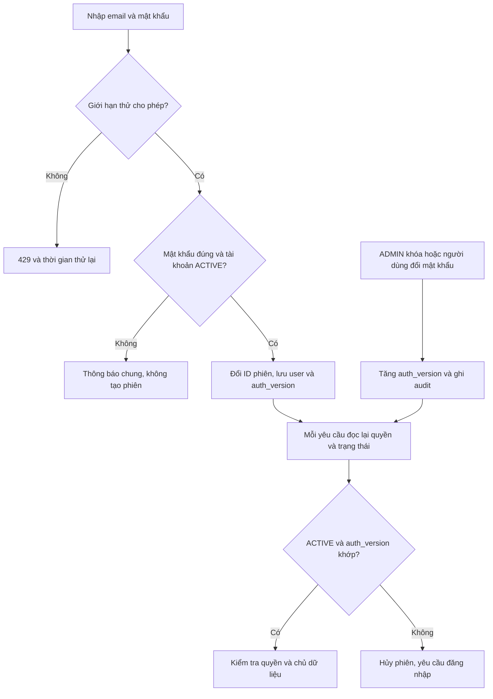

Đăng ký: validate → email unique → hash → CUSTOMER ACTIVE → đăng nhập UC-02; không tiếp nhận role từ khách.

## 4. Luồng sản phẩm, giá và công bố — UC-08..13

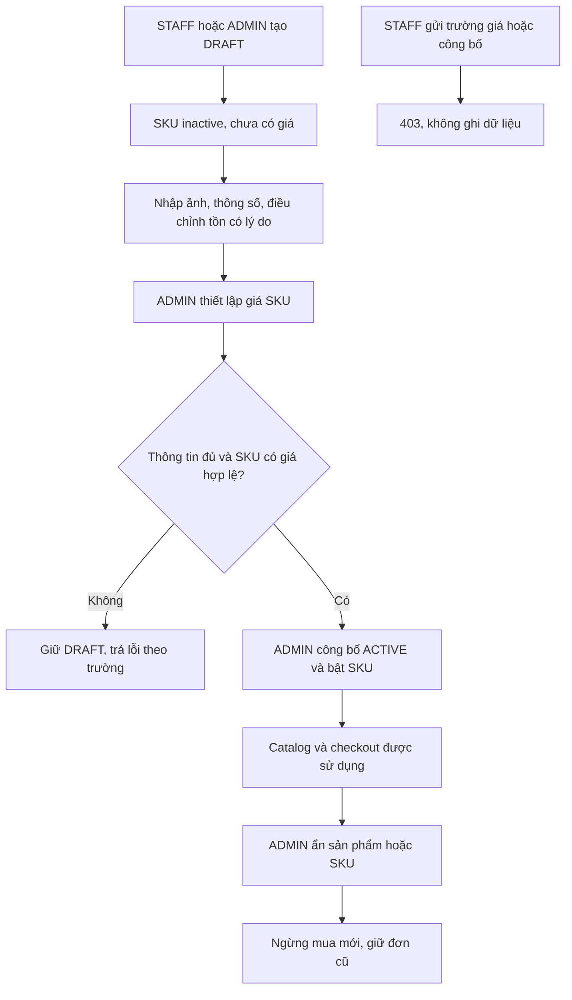

## 5. Luồng mua hàng — UC-16..26

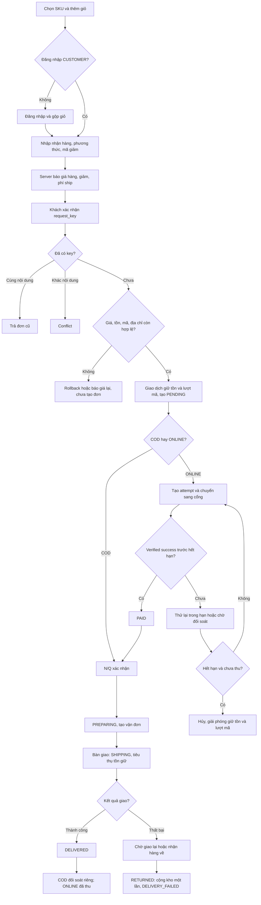

## 6. Luồng hủy/hết hạn và callback muộn — UC-20,21,23,34

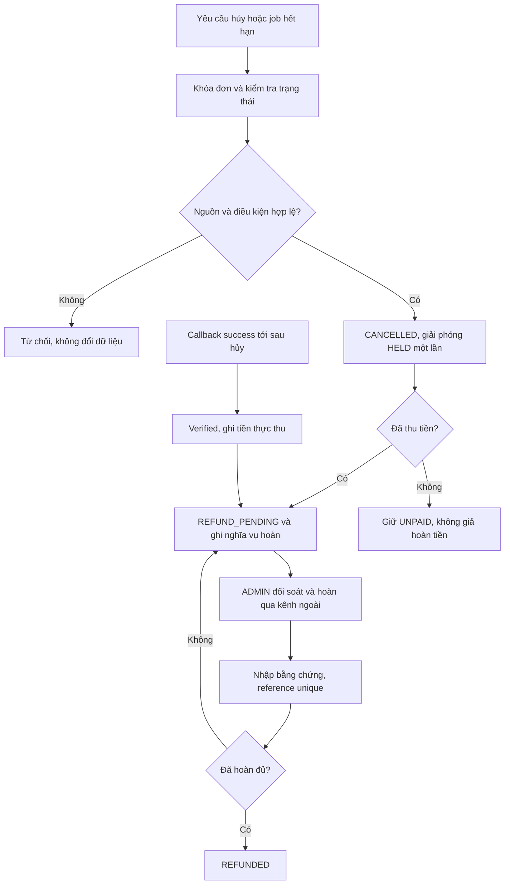

Job hết hạn và callback success phải khóa cùng đơn. Nếu success được commit trước job, job không hủy; nếu job hủy trước success, success không khôi phục hàng.

Sau PAID, deadline thanh toán không được dùng để giải phóng reservation: hàng giữ tới hủy hoặc bàn giao. Worker hết hạn chỉ chọn order ONLINE PENDING chưa thu, không quét expires_at của reservation một cách độc lập. Khi đơn hủy đã có shipment READY, lưu job hủy vận đơn ngoài hệ thống; nếu yêu cầu tạo vận đơn đang chạy trả kết quả sau hủy, ghi mã để hủy/đối soát, không chuyển đơn về trạng thái bán. Worker kiểm tra lại điều kiện trước gọi API; lỗi mạng không thể rollback thay đổi đã xảy ra ở nhà cung cấp nên dùng job bù và audit.

## 7. Sơ đồ trạng thái đơn

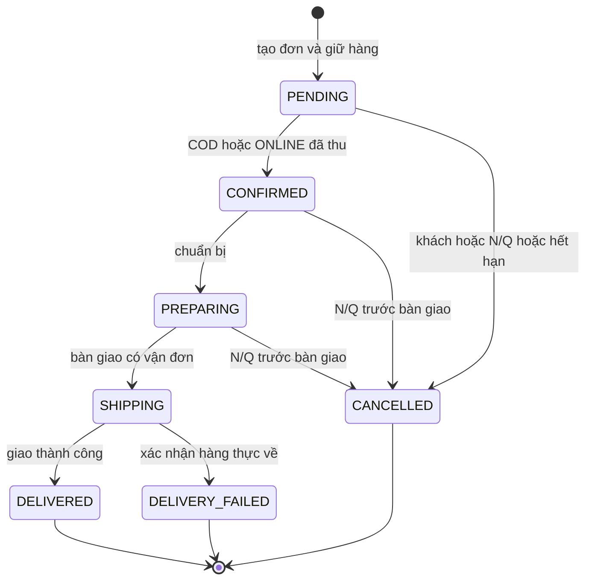

## 8. Sơ đồ trạng thái vận chuyển

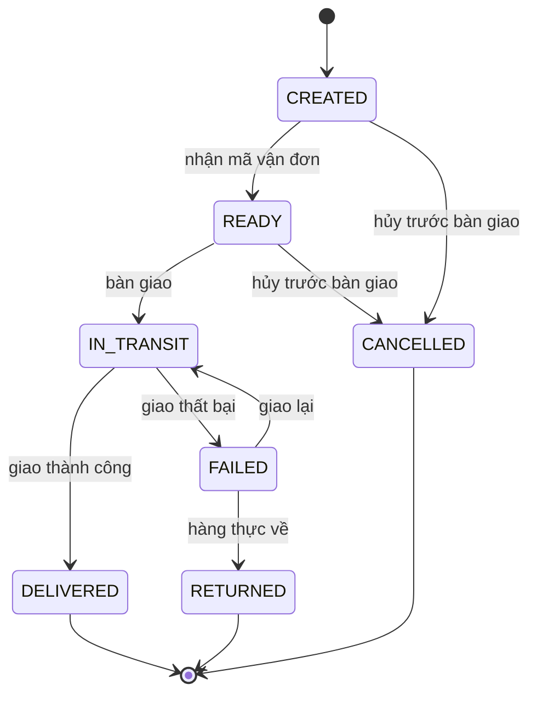

## 9. Sơ đồ tuần tự đặt hàng và thanh toán

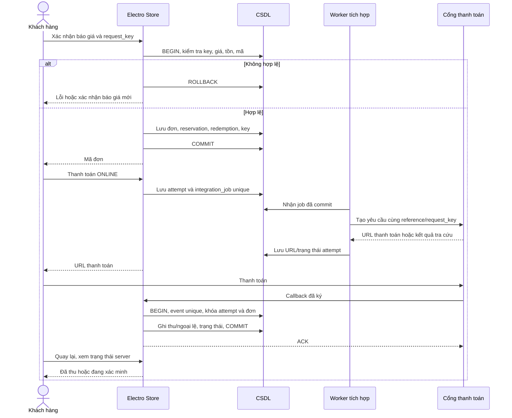

## 10. Sơ đồ tuần tự giao hàng và COD

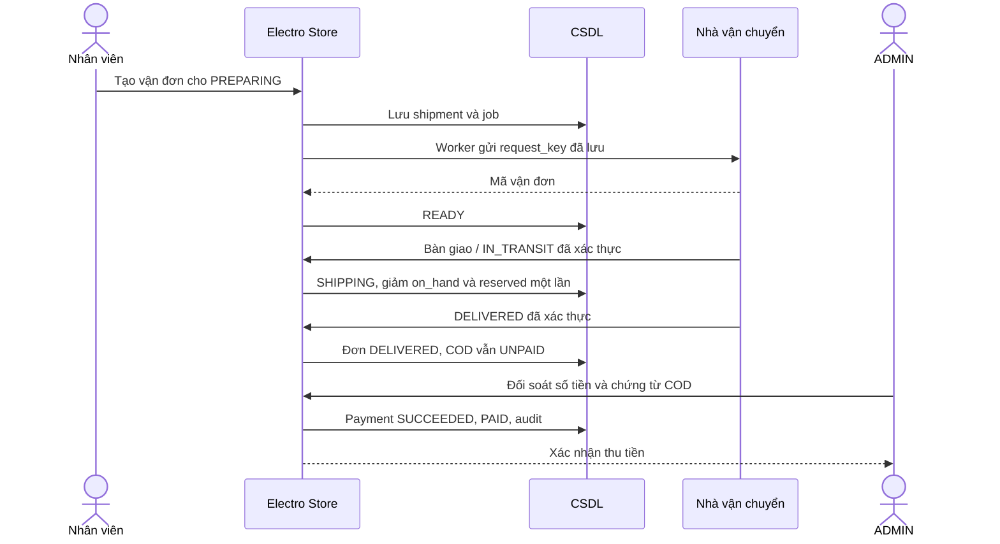

## 11. Luồng khuyến mãi, đánh giá và hỗ trợ

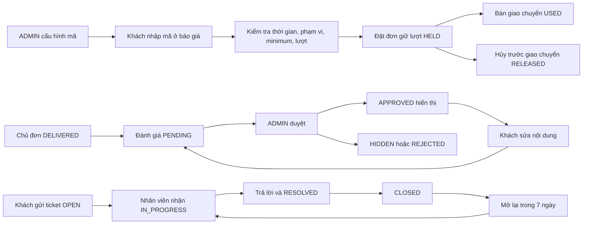

## 12. Sơ đồ dữ liệu báo cáo

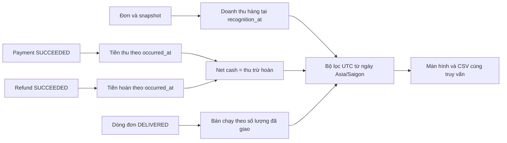

Báo cáo hiển thị riêng doanh thu hàng, phí giao, giảm giá, tiền thu, tiền hoàn và khoản chờ hoàn; không cộng callback như một khoản thu mới. Trường hợp thu dư không tạo thêm doanh thu hàng.

## 13. Sơ đồ trạng thái thanh toán của đơn

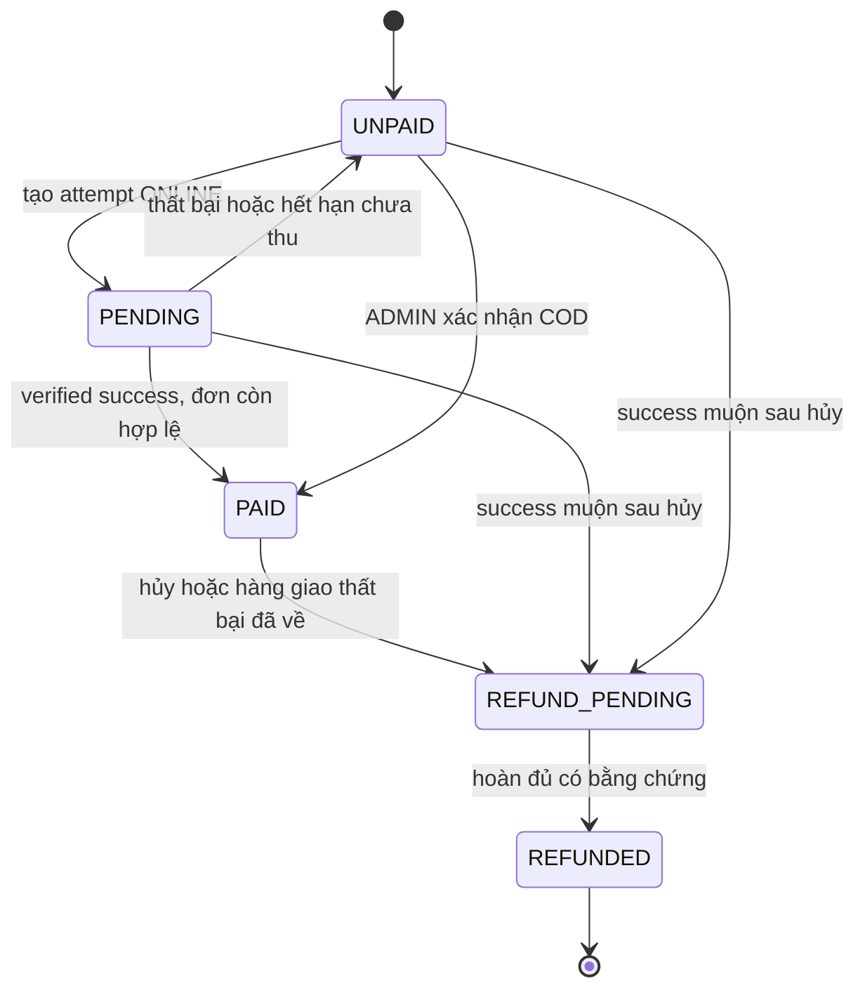

PAID không terminal: có thể cần hoàn khi hủy. Khoản thu dư sau PAID là payment_exception độc lập, không làm mất trạng thái khoản thu hợp lệ.
