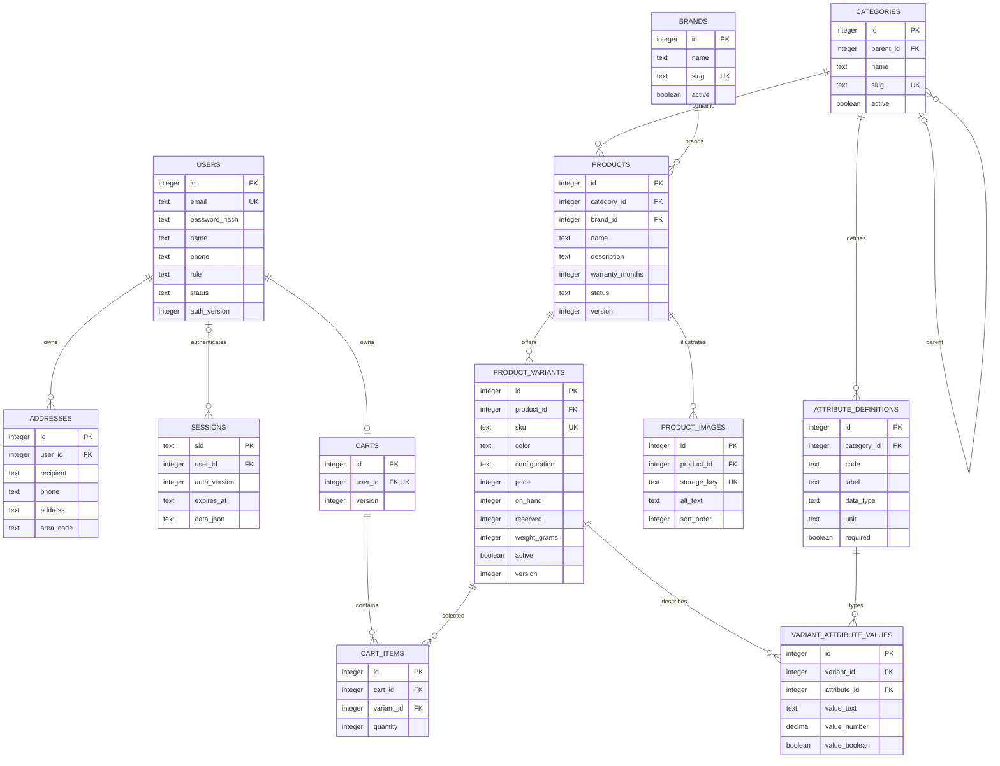
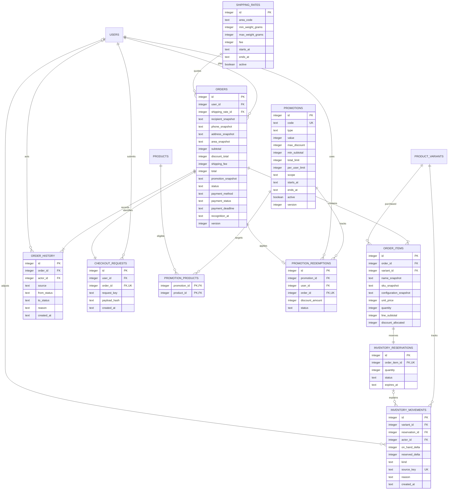
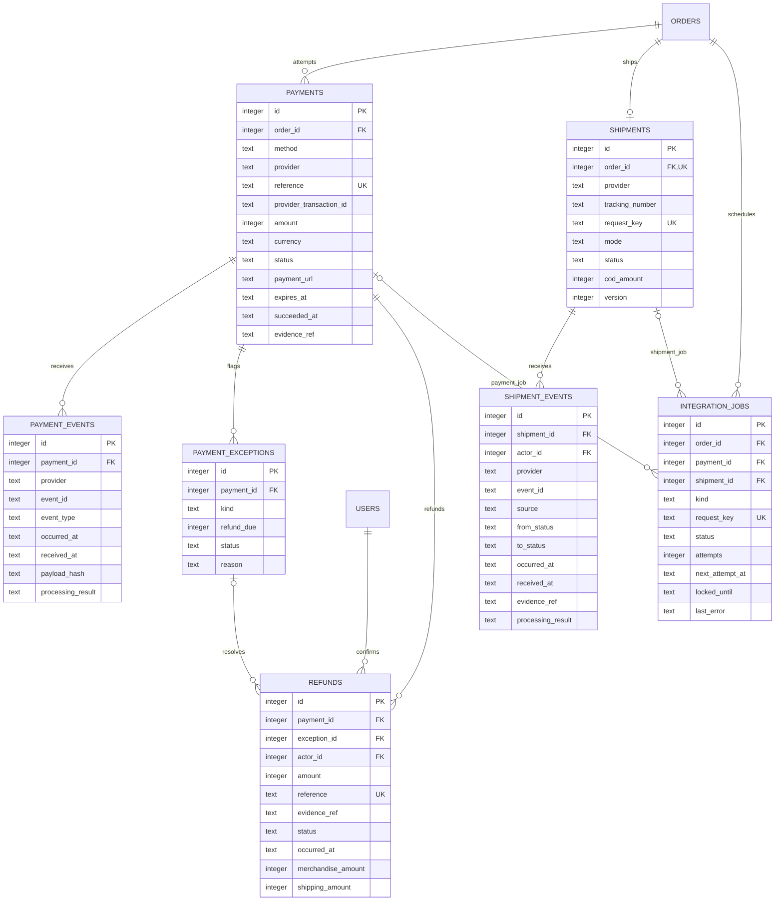
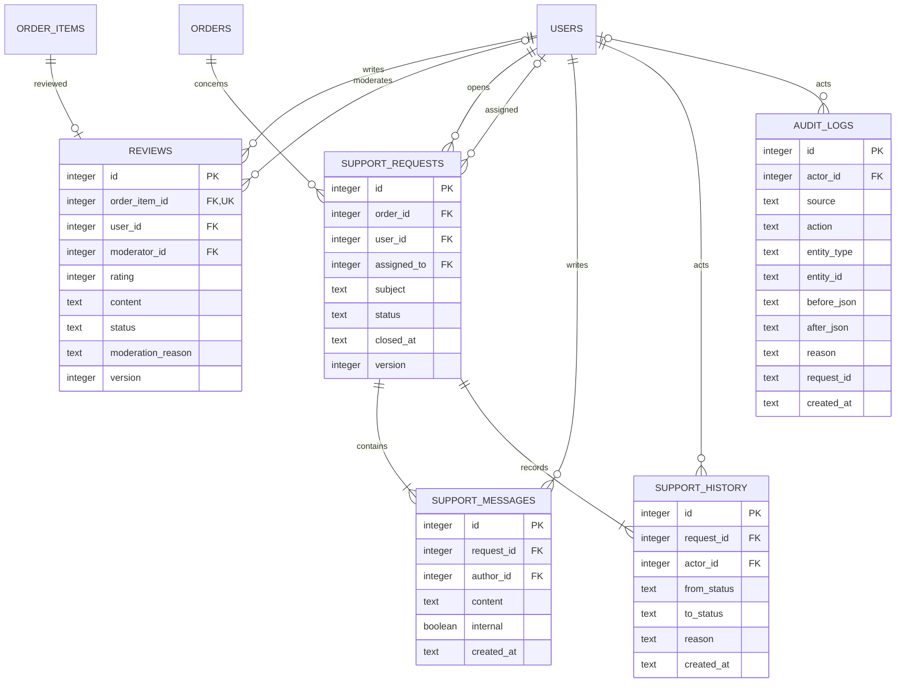

# ERD và từ điển dữ liệu toàn hệ thống

Phiên bản 1.0 — 05/10/2026. Mô hình quan hệ mục tiêu, **chưa phải schema SQLite hiện tại**. Phù hợp các UC-01..34 và BR-01..16. ERD chia theo module để đọc được; tên bảng nối giữa các sơ đồ là cùng một bảng, không phải bản sao. PK/FK/UK lần lượt là khóa chính/ngoại/unique.

Schema thực tế đến SQLite v9 và PostgreSQL v2: catalog/SKU, phiên JSON, khuyến mãi/đánh giá, địa chỉ/hỗ trợ/reset, ledger COD/VNPay/hoàn tiền, shipments/shipment_events thủ công. [Đối chiếu triển khai](12_ECARTS_ET_IMPLEMENTATION.md) ghi rõ giới hạn. Mô hình dưới đây vẫn là mục tiêu: phí còn cố định; chưa có shipping_rates, integration_jobs, payment_exceptions đầy đủ, API vận chuyển hoặc querydr.

## 1. ERD tài khoản, giỏ hàng và catalog

Vãng lai không có CARTS trong CSDL: giỏ được lưu trong data_json của phiên. CUSTOMER có tối đa một giỏ, giữ sau logout. SKU nháp cho phép price NULL, nhưng active=1 phải có price hợp lệ. DRAFT có thể chưa có SKU; ACTIVE phải có ít nhất một SKU active.

## 2. ERD đơn hàng, kho, checkout và khuyến mãi

CHECKOUT_REQUESTS ở đây là kết quả đặt hàng đã commit: mỗi đơn có đúng một key; key thất bại không lưu vào bảng này. Báo giá tạm lưu trong phiên, không giữ kho. Trong giao dịch đặt đơn, unique user/key cùng khóa ghi DB ngăn hai yêu cầu tạo đơn; cả order và key rollback nếu lỗi.

## 3. ERD thanh toán, vận chuyển và tích hợp

Tích hợp có nhiều attempt theo đơn nhưng chỉ một attempt ONLINE CREATED/PENDING đồng thời. COD có tối đa một payment thu tiền theo đơn. Một payment có nhiều callback, nhưng một khoản thu chỉ được ghi một lần theo provider_transaction_id. PAYMENTS.amount là số tiền thực được nhà cung cấp xác thực; không đổi đơn để khớp khoản tiền sai.

## 4. ERD đánh giá, hỗ trợ và audit

Audit dùng entity_type/entity_id để tham chiếu nhiều loại đối tượng: không coi đây là FK SQL đa hình. Tính tồn tại và quyền kiểm tra ở dịch vụ. Không cần bảng REPORTS hay RECOMMENDATIONS: tính từ giao dịch/catalog; CSV là đầu ra, không phải dữ liệu nghiệp vụ.

## 5. Quy ước từ điển dữ liệu

- ID integer tự sinh; sid/reference/request_key/event_id là chuỗi opaque do hệ thống/nhà cung cấp tạo, không dùng số thứ tự làm bí mật.
- Các bảng nghiệp vụ có created_at/updated_at UTC nếu cần sửa; ledger/history/event/audit chỉ có created_at hoặc occurred_at và append-only. ERD không lặp mọi timestamp để giữ sơ đồ đọc được.
- Các trường FK mặc định NOT NULL; trường optional được nêu ở bảng dưới. role là enum CUSTOMER/STAFF/ADMIN, không cần roles/user_roles vì mỗi tài khoản đúng một vai trò trong phạm vi này.
- text enum dùng CHECK; boolean dùng 0/1; tiền/đếm/khối lượng integer, không dùng số thực để tính tiền. value_number có thể dùng số thập phân cho thông số kỹ thuật, không dùng cho giá.
- before_json/after_json/data_json có cấu trúc JSON được validate và che trường nhạy cảm; password_hash không được ghi vào audit hoặc xuất báo cáo.

| Bảng | Ý nghĩa, null và ràng buộc bổ sung |
|---|---|
| users | email normalized UNIQUE; phone nullable; status ACTIVE/LOCKED; auth_version >= 1. Không xóa user có giao dịch. |
| addresses | Địa chỉ thuộc một user; area_code ánh xạ cấu hình giao hàng; sửa địa chỉ không đổi snapshot order. |
| sessions | user_id/auth_version nullable cho vãng lai; expires_at bắt buộc; lưu cart vãng lai, CSRF và báo giá; cookie chỉ chứa sid đã ký. |
| carts | user_id UNIQUE và phải là CUSTOMER; version >=1. |
| cart_items | UNIQUE(cart_id,variant_id); quantity 1–99. Xóa dòng giỏ được phép; không xóa SKU được tham chiếu. |
| categories | parent_id nullable; slug UNIQUE; cấm tự làm cha hoặc vòng; không hard-delete khi còn product/attribute/child. |
| brands | slug UNIQUE; inactive không cho tạo sản phẩm mới, không tự ẩn hàng cũ. |
| products | status DRAFT/ACTIVE/HIDDEN; warranty_months >=0, nullable nếu chưa xác định; version >=1; không tự xóa sản phẩm khi ẩn danh mục. |
| product_variants | sku UNIQUE và bất biến sau mua; color/configuration nullable; price nullable chỉ khi inactive; on_hand>=reserved>=0; weight_grams>0 khi active; version >=1. |
| product_images | storage_key UNIQUE, không đường dẫn từ khách; sort_order>=0; ảnh dùng cho product, không bắt buộc có ảnh riêng từng SKU. |
| attribute_definitions | UNIQUE(category_id,code); data_type TEXT/NUMBER/BOOLEAN; unit nullable cho TEXT/BOOLEAN; required dùng lúc công bố. |
| variant_attribute_values | UNIQUE(variant_id,attribute_id); đúng một value_* NOT NULL khớp kiểu; thuộc tính phải thuộc category của SKU; FK đơn thuần không đủ, cần kiểm tra dịch vụ/trigger. |
| orders | recipient/phone/address/area snapshot NOT NULL; subtotal>0, 0<=discount_total<subtotal, shipping_fee>=0, total=subtotal-discount_total+shipping_fee>0; status theo 06; method COD/ONLINE; deadline nullable cho COD; recognition_at nullable trước đủ điều kiện. |
| order_items | quantity 1–99, unit_price>0; line_subtotal=unit_price*quantity; 0<=discount_allocated<=line_subtotal; UNIQUE(order_id,variant_id). Tổng dòng phải khớp subtotal/discount trong giao dịch. |
| order_history | actor_id nullable khi SYSTEM/PROVIDER; from_status nullable chỉ lúc tạo; source USER/SYSTEM/PROVIDER; reason bắt buộc cho hủy/ngoại lệ. |
| inventory_reservations | order_item_id UNIQUE; quantity khớp dòng đơn; status HELD/CONSUMED/RELEASED/RETURNED; expires_at nullable cho COD. RETURNED chỉ từ CONSUMED. |
| inventory_movements | reservation_id/actor_id nullable cho điều chỉnh/hệ thống; source_key UNIQUE bảo đảm một movement mỗi sự kiện; kind ADJUST/HOLD/RELEASE/CONSUME/RETURN; hai delta không cùng 0. |
| checkout_requests | UNIQUE(user_id,request_key), order_id UNIQUE; payload_hash gồm cart, giá báo, địa chỉ, phí, mã, phương thức; không hash mật khẩu/token. |
| shipping_rates | min_weight>=0, max_weight>min_weight; weight trong [min,max); fee>=0; hiệu lực [starts,ends), ends nullable; dịch vụ cấm nhiều rate active cùng địa bàn/trọng lượng/thời gian chồng nhau. |
| promotions | code normalized uppercase UNIQUE; type FIXED/PERCENT; value>0; PERCENT<=100, max_discount>0 bắt buộc PERCENT; FIXED trần nullable; scope ALL/PRODUCT; limits>0; ends>starts; không sửa bản đã dùng ngoài active/ends_at có audit. |
| promotion_products | PK kép; scope PRODUCT cần ít nhất một product; scope ALL không sử dụng dòng phạm vi. |
| promotion_redemptions | order_id UNIQUE bảo đảm một mã/đơn; status HELD/USED/RELEASED; amount khớp discount order; user_id phải khớp chủ order. |
| payments | reference UNIQUE; provider_transaction_id nullable trước thu, UNIQUE(provider,provider_transaction_id) nếu không NULL; amount>0, currency VND; method COD/ONLINE; CREATED/PENDING/SUCCEEDED/FAILED/EXPIRED; evidence_ref bắt buộc COD SUCCEEDED; succeeded_at nullable trước thu. |
| payment_events | UNIQUE(provider,event_id); chỉ xử lý dữ liệu đã xác thực; processing_result ACCEPTED/DUPLICATE/IGNORED/EXCEPTION; event sai không ghi như giao dịch hợp lệ mà vào log bảo mật đã redacted. |
| payment_exceptions | kind LATE_SUCCESS/DUPLICATE_CAPTURE/CANCELLED_PAID/RETURNED_PAID; refund_due>0; status OPEN/RESOLVED; UNIQUE(payment_id,kind); không tạo nghĩa vụ hoàn trùng cho cùng khoản tiền. |
| refunds | exception_id nullable khi hoàn tiền đơn hủy thông thường; reference UNIQUE; amount>0, merchandise_amount+shipping_amount=amount; status SUCCEEDED cho bản đầu; tổng hoàn <= số đã thu chưa hoàn, kiểm tra cùng giao dịch. |
| shipments | order_id UNIQUE; tracking_number nullable khi CREATED, UNIQUE(provider,tracking_number) nếu có; mode API/MANUAL; cod_amount bằng total với COD chưa thu, bằng 0 với ONLINE; trạng thái theo 06. |
| shipment_events | UNIQUE(provider,event_id); actor_id nullable callback; source PROVIDER/USER; evidence_ref bắt buộc cập nhật MANUAL; lưu processing_result cho event cũ/mâu thuẫn. |
| integration_jobs | request_key UNIQUE; status QUEUED/RUNNING/SUCCEEDED/RETRY/FAILED; attempts>=0; last_error redacted; payment_id hoặc shipment_id phù hợp kind; locked_until nullable, lease cho worker; không lưu secret trong job. |
| reviews | order_item_id UNIQUE; user_id=chủ đơn DELIVERED; moderator_id nullable; rating 1–5; status PENDING/APPROVED/HIDDEN/REJECTED; content 1–2000; version >=1. |
| support_requests | user_id=chủ order; assigned_to nullable, chỉ STAFF/ADMIN; OPEN/IN_PROGRESS/RESOLVED/CLOSED; closed_at nullable trước đóng; subject 1–120; version >=1. |
| support_messages | internal=1 chỉ STAFF/ADMIN tạo/xem; content 1–2000; mỗi ticket có ít nhất tin đầu tiên. |
| support_history | from_status nullable lúc tạo; trạng thái chuyển và lý do giữ lịch sử. |
| audit_logs | actor_id nullable cho SYSTEM/PROVIDER; source/action/entity_type/entity_id bắt buộc; before/after nullable theo action; append-only, che mật khẩu/secret/PII không cần thiết. |

## 6. Công thức và ràng buộc giao dịch

### Tồn kho

| Sự kiện | on_hand_delta | reserved_delta | Reservation |
|---|---|---|---|
| Điều chỉnh vật lý | delta | 0 | Không có |
| Đặt đơn | 0 | +q | HELD |
| Hủy/hết hạn trước giao | 0 | -q | RELEASED |
| Bàn giao | -q | -q | CONSUMED |
| Hàng thực về sau giao thất bại | +q | 0 | RETURNED |

CHECK on_hand>=reserved>=0 không thay thế khóa/giao dịch. Giữ tồn bằng UPDATE có điều kiện available>=q và kiểm tra số dòng ảnh hưởng. Reservation chuyển bằng điều kiện trạng thái cũ + movement source_key UNIQUE; giao dịch rollback nếu một dòng không đủ.

### Giảm giá

- Với scope PRODUCT, eligible_subtotal là tổng các dòng thuộc phạm vi, còn min_subtotal kiểm tra trên toàn giỏ.
- FIXED: min(value,eligible_subtotal). PERCENT: min(floor(eligible_subtotal*value/100),max_discount,eligible_subtotal).
- Sau công thức trên, chặn discount tối đa subtotal-1 VND để bản đầu không tạo đơn tổng 0; báo giá hiển thị số giảm thực áp dụng.
- Phân bổ discount cho các dòng đủ điều kiện theo tỷ lệ line_subtotal; làm tròn xuống, phân bổ phần dư theo line_subtotal giảm dần rồi variant_id. Tổng discount_allocated phải đúng discount_total.
- Tổng lượt sử dụng tính HELD+USED, kiểm tra trong cùng giao dịch với insert redemption. Per-user theo users.id, không dùng cookie/IP.

### Tiền và báo cáo

- payments SUCCEEDED là ledger tiền thu; refunds SUCCEEDED là ledger tiền hoàn. Tổng thu dư không sửa orders.total; payment_exception lưu nghĩa vụ hoàn.
- recognition_at được đặt đúng một lần khi order DELIVERED và payment_status PAID. Doanh thu hàng theo recognition_at; đơn hủy/giao thất bại chưa có recognition không vào doanh thu.
- Báo cáo tiền thu gồm tất cả khoản thực thu, kể cả tiền muộn phải hoàn; hiển thị pending_refund riêng. Net cash trừ refund theo ngày thực hoàn.
- Hoàn tiền bản đầu toàn bộ khoản thu cho đơn hủy/giao thất bại, không hỗ trợ đổi trả một phần. Thu dư hoàn khoản dư; merchandise_amount/shipping_amount cho trường hợp này phân loại theo đối soát, không làm giảm doanh thu hàng hợp lệ đã ghi nhận.

## 7. Index và chiến lược xóa

- Index: orders(user_id,created_at), orders(status,created_at), order_items(order_id), order_history(order_id,id), variants(product_id,active), products(category_id,brand_id,status), reservations(status,expires_at), movements(variant_id,created_at), redemptions(promotion_id,status,user_id), payments(order_id,status), events(payment_id), shipments(status), tickets(status,assigned_to,updated_at), audit(entity_type,entity_id,created_at), jobs(status,next_attempt_at), sessions(expires_at).
- Partial UNIQUE một ONLINE attempt CREATED/PENDING trên order; một COD payment trên order. UNIQUE provider_transaction_id/tracking_number chỉ khi NOT NULL. Chọn cú pháp phù hợp DB khi triển khai.
- ON DELETE RESTRICT với user, product, variant, order, payment, shipment, promotion và ledger đã tham chiếu. Không cascade xóa đơn/tiền/audit.
- CASCADE chỉ cho dữ liệu tạm như cart_items khi xóa cart và thuộc tính/ảnh của bản nháp chưa có giao dịch sau kiểm tra quyền. File ảnh dọn theo job sau commit, không xóa trước transaction.
- Dữ liệu cần giữ lịch sử dùng active/status; dữ liệu cá nhân có quy trình ẩn danh và retention cấu hình riêng, không xóa giao dịch tùy tiện.

## 8. Migration từ schema hiện có

1. Sao lưu CSDL và kiểm tra khôi phục; chốt schema mục tiêu, tạo schema_migrations(version,applied_at).
2. Tách category/brand văn bản thành bảng, chuẩn hóa và ánh xạ rõ ràng; không nhập lại dữ liệu mẫu vào DB thật.
3. Mỗi product hiện có tạo SKU mặc định; giữ giá và active; on_hand ban đầu = stock khả dụng hiện tại + tổng quantity của đơn chưa bàn giao đang giữ, reserved = tổng đang giữ. Các đơn SHIPPING đã trừ kho trong bản cũ không được trừ thêm lần nữa.
4. Tạo reservation HELD cho PENDING/CONFIRMED/PREPARING, CONSUMED cho SHIPPING/DELIVERED, RELEASED cho CANCELLED; lịch sử movement migration có source_key và ghi rõ là số dư chuyển đổi, không giả lịch sử nhập hàng.
5. Ánh xạ order_items vào SKU; giữ name/price/quantity cũ; snapshot cấu hình và phí/giảm trước đó =0 nếu bản demo không có. Không thay giá đơn theo giá SKU mới.
6. COD DELIVERED bản cũ đã PAID không mặc nhiên có chứng từ đối soát: đánh dấu nguồn LEGACY_IMPORT và yêu cầu đối soát trước dùng làm số liệu thật. Không tự tạo payment có bằng chứng giả.
7. Chuyển cart product_id sang variant_id; giỏ MemoryStore cũ không lấy được thì thông báo khách tạo lại. Triển khai persistent session từ thời điểm migration.
8. Đối chiếu số tài khoản/sản phẩm/đơn, tổng tiền từng đơn, available trước/sau; kiểm thử đặt/hủy/giao, callback lặp/muộn. Dừng migration nếu chênh lệch; khôi phục backup theo quy trình.

Không chạy migration trong giai đoạn tài liệu này. Các CHECK liên bảng như quyền chủ đơn, thuộc tính theo danh mục, tổng tiền, lượt mã và transitions cần dịch vụ/trigger cùng transaction, không chỉ thêm FK là đủ.

Biểu phí shipping_rates được nạp qua cấu hình/migration có kiểm tra và audit bởi người triển khai được ADMIN ủy quyền; bản đầu chưa có màn hình quản lý biểu phí riêng. Không nhập số phí tùy ý từ khách hoặc STAFF. Nếu thêm UI cấu hình phí sau này, cần thêm use case ADMIN tương ứng.
