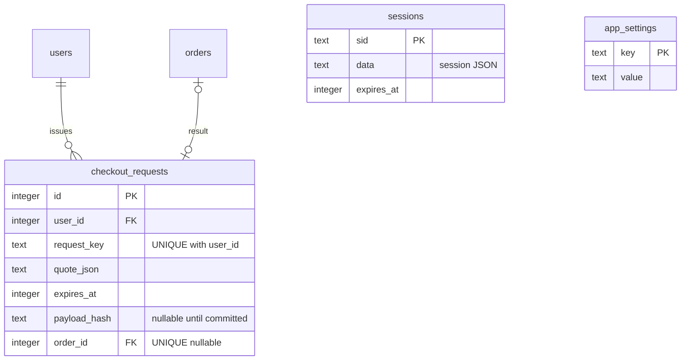
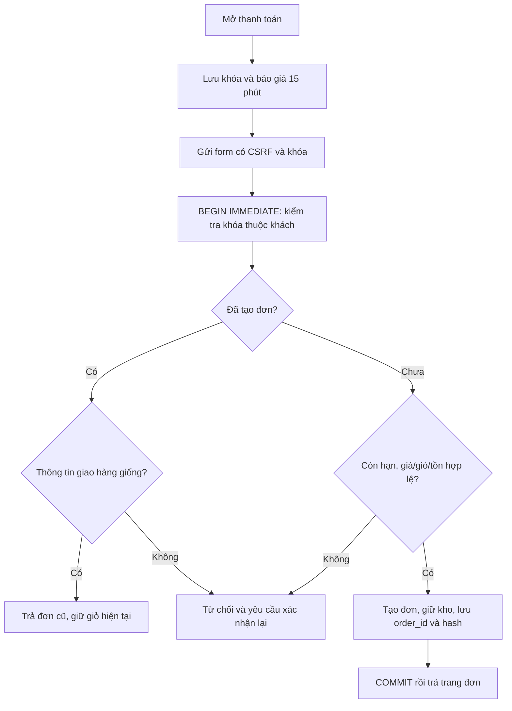
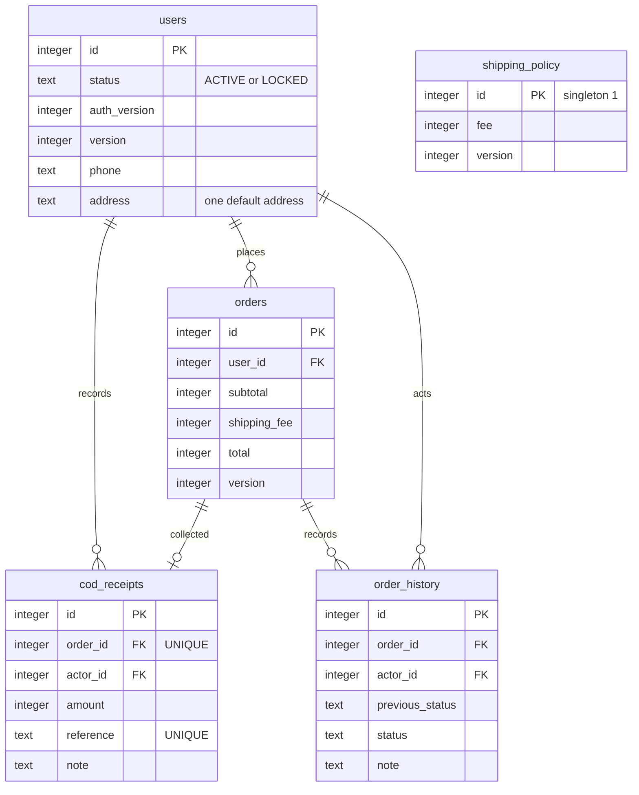
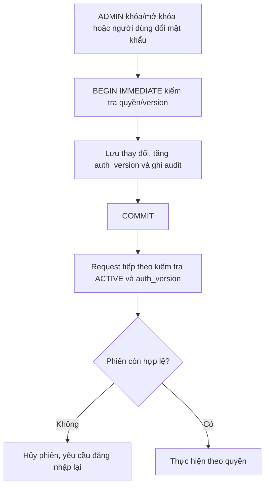
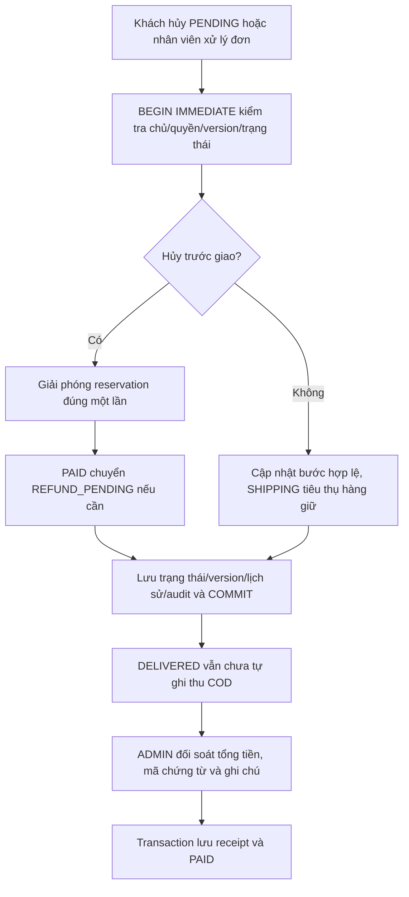
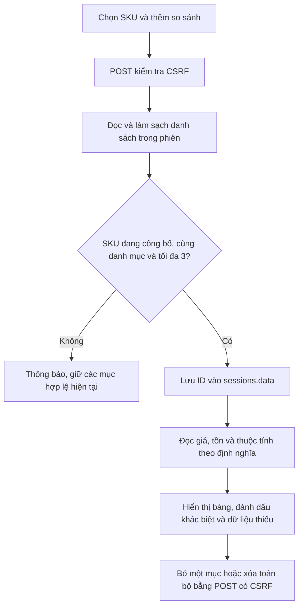
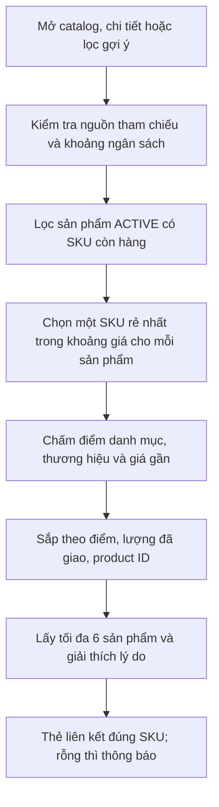

# Tiến độ triển khai website

Ngày cập nhật: 07/10/2026. Triển khai toàn bộ website theo từng bước; bộ phân tích ở docs/README.md là thiết kế mục tiêu.

## Cập nhật — đối chiếu docs và vận chuyển

Đã đối chiếu đủ 34 UC tại [12](12_ECARTS_ET_IMPLEMENTATION.md), bổ sung UC-25/26 chế độ thủ công theo BR-03/09: vận đơn, bằng chứng, handoff, giao lại, nhận hàng về đúng một lần và DELIVERY_FAILED/chờ hoàn tiền. SQLite v9, PostgreSQL v2. PostgreSQL hiện có đã sao lưu custom dump trước migration; nâng cấp giữ nguyên 3 tài khoản và 2 đơn tại thời điểm kiểm tra. 82 bài local và 7 bài PostgreSQL đạt, cả hai smoke đạt. [13](13_SU_DUNG_VAN_CHUYEN.md) hướng dẫn sử dụng; biểu phí địa bàn/trọng lượng, jobs bền và các adapter ngoài còn thiếu theo bảng 12, không coi đã hoàn thành mọi UC/AT.

## Bước 1 — Danh mục/thương hiệu và nền tảng migration

- Thêm categories, brands và schema_migrations; liên kết products.category_id/brand_id, index và FK.
- Chuyển dữ liệu tên cũ thành danh mục/thương hiệu; xử lý slug trùng do tên có dấu/không dấu; giữ ID sản phẩm, giá, tồn và đơn hàng.
- Sao lưu nhất quán bằng SQLite VACUUM INTO trước migration trên file; không nâng cấp nếu sao lưu thất bại. Schema + dữ liệu + phiên bản cùng transaction; rollback khi lỗi.
- ADMIN tạo/sửa/đổi trạng thái danh mục và thương hiệu. Đổi tên cập nhật sản phẩm liên quan; ngừng sử dụng chỉ ngăn gán mới, không tự ẩn hàng đang bán. Không có hard-delete trên UI.
- Sản phẩm chọn danh mục/thương hiệu từ danh sách; backend chặn tên không có hoặc gán mới vào mục ngừng sử dụng. Sản phẩm đang thuộc mục ngừng sử dụng vẫn được sửa thông tin/tồn.
- Chỉ ADMIN quản lý catalog và sửa giá; CUSTOMER/STAFF không được gọi chức năng quản lý catalog.

### Kiểm tra thủ công

1. Chạy `npm.cmd run dev`; đăng nhập ADMIN đã cấu hình.
2. Mở Quản lý → Danh mục và thương hiệu, hoặc `/admin/catalog`.
3. Thêm tên và slug (ví dụ `Máy ảnh`, `may-anh`); tạo thương hiệu.
4. Quay lại sản phẩm: chọn các giá trị vừa tạo và mô tả, lưu bản nháp; theo bước 2 bên dưới để tạo SKU và bán.
5. Đổi tên danh mục, xem sản phẩm để kiểm tra đồng bộ.
6. Ngừng sử dụng danh mục: không chọn được khi thêm mới, sản phẩm cũ vẫn hiển thị và sửa được.
7. Chạy `npm.cmd test` và `npm.cmd run test:smoke`.

### Khôi phục nếu cần

Dừng ứng dụng trước khi thay file. Giữ lại file hiện tại để đối soát; chọn backup `before-migration-*.sqlite` phù hợp tại data/backups, sao chép thay data/store.sqlite. Để chạy lại đúng phiên bản schema cũ phải dùng mã ứng dụng tương ứng; chạy mã mới sẽ tự migration và tạo backup mới. Không xóa backup trước khi kiểm tra đơn/giá/tồn.

### Giới hạn của bước 1

- Vẫn giữ cột category/brand văn bản để tương thích; app cập nhật cả ID và tên, trigger đồng bộ khi đổi tên. Cột ID hiện nullable cho dữ liệu fixture/legacy; dọn schema sẽ hoàn tất ràng buộc và bỏ cột dư. Dữ liệu ứng dụng tạo đã có ID.
- Chưa có danh mục phân cấp, định nghĩa thông số, audit quản trị hoặc chống ghi đè bằng version; các phần này thuộc những bước tiếp theo, chưa coi UC-13 hoàn tất toàn bộ.
- Danh mục/thương hiệu đang dùng chưa phân trang. Phân trang sẽ triển khai cùng danh sách sản phẩm/quản trị.

## Bước 2 — Sản phẩm/SKU và kho

- Migration v2 tạo một SKU LEGACY mặc định cho mỗi sản phẩm cũ, giữ nguyên giá đơn; PENDING/CONFIRMED/PREPARING có reservation HELD, SHIPPING/DELIVERED là CONSUMED, CANCELLED là RELEASED.
- on_hand = stock khả dụng cũ + lượng đang giữ trước giao; reserved = lượng đang giữ; available trước/sau không đổi. Đơn đang giao không bị trừ thêm lần nữa.
- STAFF/ADMIN tạo DRAFT, thêm SKU chưa có giá/inactive. ADMIN đặt giá và bật bán SKU, rồi công bố sản phẩm. SKU cuối đang bán không thể bị tắt khi sản phẩm vẫn ACTIVE; cần ẩn sản phẩm trước.
- Mỗi SKU có màu/cấu hình, giá, on_hand/reserved và version riêng. SKU đã xuất hiện trong đơn không được đổi mã; thay màu/cấu hình không đổi snapshot đơn cũ.
- Điều chỉnh kho bằng delta có lý do, không được giảm thấp hơn reserved; movements và audit cùng giao dịch. Version kiểm tra lại sau lấy khóa giao dịch.
- Catalog hiển thị giá từ SKU, chi tiết cho chọn cấu hình; giỏ lưu variant_id. Giỏ phiên cũ được đặt lại có thông báo để tránh hiểu nhầm product_id thành variant_id.
- Đặt đơn giữ hàng, hủy giải phóng một lần, SHIPPING tiêu thụ on_hand/reserved. Audit sản phẩm/SKU lưu CSDL; trang SKU hiển thị 50 movement mới nhất.

### Kiểm tra thủ công bước 2

1. N/Q mở Quản lý, tạo bản nháp và chọn danh mục/thương hiệu.
2. Mở sản phẩm quản lý, thêm SKU (ví dụ PHONE-BLACK-128), màu và cấu hình.
3. Điều chỉnh tồn +5 có lý do; sau mỗi thao tác trang tải lại để lấy version mới.
4. ADMIN đặt giá, chọn Bật bán, lưu; sau đó công bố sản phẩm.
5. Khách mở chi tiết, chọn cấu hình, thêm giỏ và đặt COD; kiểm tra SKU/cấu hình trong đơn.
6. N/Q hủy để kiểm tra reserved được giải phóng; với đơn khác chuyển qua PREPARING→SHIPPING để kiểm tra on_hand giảm.

### Phần chưa hoàn thiện

Ảnh thật, thông số có cấu trúc, cân nặng/phí ship, phân trang và màn hình audit chung thuộc bước tiếp theo. Công bố hiện kiểm tra SKU có giá/bật bán, chưa kiểm tra ảnh và thuộc tính bắt buộc. price/stock cũ ở products không còn là nguồn bán hàng; sản phẩm nháp dùng giá tương thích nội bộ 1 VND ở cột cũ do schema cũ bắt buộc, không hiển thị hoặc checkout giá này. Giá SKU nháp thực là NULL. Sẽ bỏ các cột dư bằng migration dọn schema, không coi mô hình ERD đã được triển khai hoàn toàn.

COD vẫn đánh dấu PAID lúc DELIVERED theo bản demo cũ; việc tách xác nhận tiền, vận đơn và callback sẽ thực hiện trong các bước đơn hàng/thanh toán.

### Kết quả kiểm tra bước 2

13 kiểm thử nghiệp vụ đạt, gồm hai kết nối đồng thời tranh SKU cuối, rollback giữa giao dịch, version cũ, snapshot SKU và migration đơn đang giao. Smoke test HTTP đạt với tài khoản STAFF/ADMIN/CUSTOMER: tạo nháp, chặn sửa giá/công bố trái quyền, đặt giá, tăng tồn, công bố và đặt đơn SKU. CSDL local đã migration v2; đối chiếu backup thực trước v2 xác nhận giá, tồn khả dụng và snapshot đơn giữ nguyên; integrity_check và foreign_key_check đạt. Backup nằm trong data/backups, không đưa vào Git.

## Bước 3 — Ảnh, thông số kỹ thuật và phân trang sản phẩm

- Migration v3 thêm product_images, attribute_definitions và variant_attribute_values; không thay giá/tồn/reservation/snapshot đơn.
- N/Q tải ảnh tĩnh JPEG/PNG/WebP tối đa 5MB, tối đa 20 triệu pixel, 10 ảnh/sản phẩm. Kiểm tra chữ ký định dạng, giải mã bằng sharp, xoay theo EXIF, thu nhỏ tối đa 1600×1600 và xuất WebP. Không nhận SVG/tệp thực thi hoặc tin phần mở rộng tệp.
- Sửa alt/thứ tự, xóa ảnh có version và audit; ảnh nháp/ẩn không phục vụ công khai. Không xóa ảnh cuối của sản phẩm ACTIVE; ẩn trước nếu cần.
- **Lựa chọn triển khai cho cửa hàng nhỏ:** ảnh WebP lưu BLOB trong SQLite, storage_key là mã phục vụ media. Backup CSDL bao gồm ảnh và không có file ảnh mồ côi. ERD mục tiêu vẫn cho phép chuyển storage_key sang object storage sau này; khi DB lớn cần đánh giá lại lưu trữ.
- Q tạo/sửa định nghĩa thông số ở `/admin/attributes`. N/Q nhập giá trị theo danh mục trên từng SKU; kiểu TEXT/NUMBER/BOOLEAN; số 0 và boolean Không không bị coi thiếu. Không đổi kiểu, mã, danh mục hoặc đơn vị khi đã có dữ liệu.
- Công bố kiểm tra ít nhất một ảnh và các SKU bật bán đã đủ thông số bắt buộc. Đổi danh mục sản phẩm ACTIVE phải ẩn trước; SKU đã có giá trị phải xóa giá trị cũ trước khi đổi danh mục.
- Khi muốn thêm thông số bắt buộc cho hàng đang ACTIVE, tạo tùy chọn trước, bổ sung giá trị rồi chuyển bắt buộc; hệ thống chặn nếu có SKU active còn thiếu.
- Catalog và quản lý sản phẩm phân trang 20 mục; lọc tên/danh mục/thương hiệu/khoảng giá/trạng thái quản lý. Giữ bộ lọc và sort khi chuyển trang, reset về trang đầu khi gửi bộ lọc mới. Khoảng giá xét các SKU đang bán phù hợp, không chỉ giá rẻ nhất của sản phẩm.

### Kiểm tra thủ công bước 3

1. ADMIN vào Quản lý → Thông số kỹ thuật, chọn danh mục; tạo RAM kiểu Số/GB, Wi-Fi kiểu Có/Không hoặc màn hình kiểu Văn bản.
2. STAFF/ADMIN mở bản nháp, tải ảnh và nhập giá trị trong phần Thông số kỹ thuật của SKU.
3. ADMIN đặt giá/bật SKU rồi công bố; nếu thiếu ảnh/thông số bắt buộc, hệ thống thông báo và không công bố.
4. Xem catalog/chi tiết để kiểm tra ảnh đại diện, bộ ảnh và bảng thông số.
5. Thử lọc thương hiệu/khoảng giá, sắp xếp và chuyển trang trên catalog hoặc quản lý.

### Giới hạn và tương thích

Sản phẩm ACTIVE cũ được giữ nguyên sau migration, có thể chưa có ảnh/thông số; không tự ẩn dữ liệu demo. Khi công bố lại phải đáp ứng điều kiện mới. Tải ảnh dùng JavaScript với thông báo tiến trình; các form khác vẫn dùng server render. Chưa có lọc theo thuộc tính nâng cao, danh mục phân cấp, xóa định nghĩa thông số hoặc chuyển ảnh sang object storage. Các cột giá/tồn legacy chưa được xóa. Giao diện chưa kiểm tra trực quan bằng trình duyệt tự động trong môi trường này.

### Kiểm thử

17 kiểm thử nghiệp vụ đạt và smoke test HTTP đạt: upload/đọc ảnh, chặn ảnh nháp với khách, quyền STAFF/ADMIN, định nghĩa/nhập/hiển thị thông số, phân trang/lọc và luồng SKU/COD. Kiểm thử catalog có 105 sản phẩm, không mất dữ liệu sau mốc 100, không trùng giữa trang; kiểm thử ảnh giả/quá 5MB/version thay đổi giữa decode và lưu; kiểm thử số 0/boolean false và chặn thiếu thông số khi công bố.

Tham khảo API thư viện đã dùng: [sharp constructor](https://sharp.pixelplumbing.com/api-constructor/), [sharp output](https://sharp.pixelplumbing.com/api-output/). Các kết quả kiểm thử trên là từ mã trong dự án, không phải từ tài liệu thư viện.

## Bước tiếp theo

## Bước 4 — Phiên bền vững và chống đặt trùng (đã triển khai)

Migration v4 bổ sung sessions, app_settings và checkout_requests; sao lưu trước nâng cấp. Phiên lưu JSON và thời điểm hết hạn, cookie tối đa 24 giờ; logout xóa phiên, đăng nhập tạo phiên mới. Khóa ký local lưu CSDL để cookie còn hiệu lực sau restart; production dùng SESSION_SECRET ổn định.

GET checkout cấp khóa ngẫu nhiên gắn user và snapshot SKU/số lượng/giá, thời hạn 15 phút. POST kiểm tra chủ sở hữu, thời hạn, giỏ và giá; tạo đơn, giữ tồn và lưu kết quả trong cùng transaction BEGIN IMMEDIATE. UNIQUE(user_id,request_key) chống trùng giữa nhiều kết nối. Yêu cầu hoàn tất trả lại order_id kể cả giỏ trống; đổi tên/điện thoại/địa chỉ với cùng khóa bị từ chối. Không xóa giỏ mới khi trả lại kết quả cũ. Khóa hoàn tất được giữ để truy lại kết quả; khóa chưa dùng quá hạn được dọn khi mở checkout.

Kiểm tra thủ công: đăng nhập, thêm SKU, khởi động lại server và mở giỏ; đặt đơn rồi gửi lại cùng form phải về cùng đơn. Thay địa chỉ với cùng khóa phải bị chặn. Đổi giá sau khi mở checkout phải xác nhận lại. Logout rồi dùng cookie cũ phải yêu cầu đăng nhập.

Giới hạn: giỏ lưu theo phiên, chưa đồng bộ nhiều thiết bị; lần nâng cấp đầu từ MemoryStore cần đăng nhập lại. SQLite store chưa giải quyết đồng thời sửa giỏ trên nhiều tab; khóa đặt hàng bảo vệ đơn và kho. HTTPS/proxy production thuộc bước triển khai.

Kiểm thử: 22 kiểm thử đạt, gồm khởi động lại tiến trình HTTP vẫn giữ đăng nhập/CSRF/giỏ; hai worker dùng hai kết nối gửi cùng khóa chỉ tạo một đơn/một reservation; chặn đổi payload, dùng khóa người khác, khóa giả, giá/giỏ thay đổi và hết hạn; lỗi ghi kết quả rollback đơn và kho. Smoke test HTTP đạt. CSDL local v4 có integrity_check=ok và không lỗi khóa ngoại.

ERD bổ sung cho schema thực tế bước 4 (tài liệu ERD tổng thể vẫn mô tả đích phát triển):

Luồng xử lý thực tế:

## Bước 5 — Hồ sơ, tài khoản và quản lý đơn (đã triển khai)

### Tài khoản và phân quyền

- `/profile` cho CUSTOMER/STAFF/ADMIN sửa tên, số điện thoại và một địa chỉ mặc định của chính mình. Email bất biến; không nhận id/role/status từ form hồ sơ. Checkout điền sẵn hồ sơ, nhưng đơn đã tạo giữ snapshot cũ.
- Đổi mật khẩu cần mật khẩu hiện tại, mật khẩu mới 10–128 ký tự và xác nhận khớp; tăng auth_version và buộc đăng nhập lại. Backend đọc status/auth_version mỗi request; phiên trên thiết bị khác bị vô hiệu ngay ở request tiếp theo. Phiên v4 không có authVersion chỉ tương thích khi user.auth_version=1.
- `/admin/accounts`: chỉ ADMIN tìm/lọc/phân trang 20 tài khoản, tạo STAFF, sửa tên/điện thoại STAFF, khóa/mở khóa có lý do. Không đổi vai trò, không cấp ADMIN qua UI, không xóa tài khoản. Khóa và mở khóa đều tăng auth_version; mở khóa không phục hồi phiên cũ. Không tự khóa ADMIN đang sử dụng; giữ ít nhất một ADMIN hoạt động.
- Audit không ghi mật khẩu/hash mật khẩu/CSRF/session; cập nhật hồ sơ chỉ ghi tên trường và version, không sao chép địa chỉ vào audit. Đăng nhập STAFF/ADMIN không chuyển giỏ khách vào phiên nội bộ.

### Đơn hàng, COD và phí giao hàng

- `/orders` và `/admin/orders`: tìm theo mã/người nhận/điện thoại, lọc trạng thái và ngày UTC, phân trang ổn định 20 mục. CUSTOMER chỉ truy vấn đơn của mình; truy cập/hủy đơn người khác trả 404.
- CUSTOMER hủy PENDING với lý do; STAFF/ADMIN xử lý các bước hợp lệ và hủy trước SHIPPING. Version và trạng thái kiểm tra trong BEGIN IMMEDIATE; hủy lặp không giải phóng tồn thêm. Lịch sử ghi actor, trước/sau và ghi chú; audit cùng transaction. ONLINE chưa PAID không được xác nhận. Hủy PAID chuyển REFUND_PENDING, chưa đánh dấu đã hoàn.
- DELIVERED không tự chuyển COD sang PAID nữa. Chỉ ADMIN ghi đủ tổng tiền đã thu sau giao, kèm mã chứng từ unique và ghi chú; receipt và trạng thái tiền cùng transaction. Gửi lại cùng chứng từ trả kết quả cũ; khác chứng từ cho cùng đơn hoặc dùng mã cho đơn khác bị chặn. Đơn PAID trước migration giữ nguyên; không tự tạo chứng từ lịch sử.
- `/admin/shipping`: ADMIN cấu hình phí cố định 0–1.000.000 VND, có version/lý do/audit. Phí mặc định 0 chỉ cho bản demo local; chưa phải biểu phí theo địa bàn/trọng lượng. Checkout lưu phí cùng báo giá; đổi phí cần xác nhận lại trước đặt đơn. Đơn lưu subtotal/shipping_fee/total và giữ nguyên khi biểu phí đổi.

### Dữ liệu và kiểm tra thủ công

Migration v5 thêm status/auth_version/version/phone/address vào users; version/subtotal/shipping_fee vào orders; previous_status/note vào order_history; shipping_fee vào checkout_requests; shipping_policy và cod_receipts. Dữ liệu cũ có subtotal=total, shipping_fee=0, user ACTIVE/auth_version=1. Migration không đổi mật khẩu, vai trò, total, trạng thái tiền, giỏ/phiên hay khóa đặt hàng cũ; sao lưu trước nâng cấp file.

1. Khách mở Hồ sơ, lưu điện thoại/địa chỉ, đặt hàng và kiểm tra form điền sẵn. Sửa hồ sơ sau đặt hàng: địa chỉ trong đơn cũ không đổi.
2. ADMIN mở Quản lý → Tài khoản và nhân viên, tạo STAFF, sửa tên, khóa/mở khóa. Người bị khóa không đăng nhập; mở khóa phải đăng nhập mới. STAFF không truy cập màn hình này.
3. Đăng nhập cùng khách trên hai trình duyệt; đổi mật khẩu ở một trình duyệt. Cả hai cần đăng nhập lại, mật khẩu cũ bị từ chối.
4. Khách hủy đơn PENDING với lý do; không có nút hủy sau xác nhận. Nhân viên xử lý đơn với ghi chú; mở hai tab, cập nhật một tab rồi gửi tab cũ phải bị chặn.
5. ADMIN đổi phí giao hàng, kiểm tra checkout và tổng đơn; báo giá mở trước lúc đổi phí phải xác nhận lại.
6. Nhân viên giao xong vẫn thấy Chưa thu tiền; ADMIN mở chi tiết đơn, nhập tổng tiền/mã chứng từ/ghi chú rồi xác nhận đã thu. Khách nhìn thấy Đã thu tiền, không thấy thông tin chứng từ nội bộ.

### ERD bổ sung thực tế

### Luồng thực tế

### Giới hạn còn lại

Chỉ một địa chỉ mặc định, chưa có sổ địa chỉ hay quên mật khẩu. Chưa tích hợp thanh toán, vận đơn và callback; SHIPPING/DELIVERED cập nhật thủ công sau xử lý thực tế. Phí cố định là giải pháp local trước module shipping_rate mục tiêu. Ghi nhận COD là đối soát thủ công với tham chiếu, chưa upload bằng chứng/thu từng phần/hoàn tiền. Audit mới lưu CSDL, chưa có màn hình tra cứu. Giao diện được kiểm tra bằng HTTP/render EJS, chưa kiểm tra trực quan bằng trình duyệt tự động.

### Kết quả kiểm thử bước 5

`npm.cmd test`: 32/32 đạt; `npm.cmd run test:smoke`: đạt. Kiểm thử mới bao phủ UC-04/05/19/20/21 và phần COD UC-24: quyền/CSRF, đăng ký không cấp ADMIN từ payload, profile không sửa user khác/role/email, đổi mật khẩu trên hai phiên, khóa/mở khóa không phục hồi phiên, tạo/sửa nhân viên, hủy đúng chủ/trạng thái, version cũ, hủy lặp, rollback khi ghi lịch sử/receipt lỗi, phí thay đổi phải báo giá lại và giữ snapshot, chứng từ COD unique, hai worker hủy/xác nhận tranh chấp. Danh sách test có hơn 100 tài khoản/đơn để kiểm tra phân trang, bộ lọc và giới hạn theo chủ.

CSDL local đã lên v5, integrity_check=ok và không lỗi khóa ngoại. Đối chiếu 13 bảng nghiệp vụ theo các cột cũ với bản sao lưu v4: không có khác biệt; các đơn cũ có subtotal=total và shipping_fee=0. Đây là kết quả cho phạm vi bước 5, không xác nhận toàn bộ 34 use case mục tiêu đã hoàn thành.

## Bước 6 — So sánh SKU và gợi ý sản phẩm (đã triển khai)

### Phạm vi UC-14, UC-15 và BR-14

- `/compare` công khai cho vãng lai và người đăng nhập: thêm ở từng SKU trong trang chi tiết, tối đa 3 SKU cùng category_id, không trùng. Bỏ một SKU giữ các mục khác; có xóa toàn bộ. POST được kiểm tra CSRF. SKU ACTIVE có giá được so sánh dù hết hàng; SKU tắt bán hoặc sản phẩm DRAFT/HIDDEN tự loại khỏi phiên ở request tiếp theo, kèm thông báo.
- Bảng ngang gồm tên, ảnh hiện có, SKU, thương hiệu, màu, cấu hình, giá hiện tại, tồn khả dụng và toàn bộ thuộc tính của danh mục. Dữ liệu đọc theo định nghĩa có kiểu/đơn vị; 0/false giữ giá trị, null hiển thị “Chưa có thông tin”. Hàng khác nhau có nền và nhãn “Khác nhau”; có thể cuộn ngang trên màn hình nhỏ.
- Gợi ý hiện trên catalog và chi tiết; `/recommendations` lọc danh mục, thương hiệu và khoảng giá nguyên VND 0–1 tỷ. Tối đa 6 sản phẩm, không lặp sản phẩm. Mỗi sản phẩm chọn SKU đang bật bán, có giá, còn tồn khả dụng, rẻ nhất trong khoảng lọc (giá bằng nhau lấy SKU ID nhỏ hơn). Thẻ hiển thị đúng giá/tồn/cấu hình của SKU này và liên kết thẳng tới cấu hình.
- Có sản phẩm tham chiếu: cùng category_id +50, cùng brand_id +20, giá chênh không quá 20% so với SKU tham chiếu +10. Điểm giảm dần, rồi tổng quantity trong đơn DELIVERED giảm dần, rồi product ID tăng dần. Không tính PENDING/SHIPPING/CANCELLED vào lượng đã giao. Loại chính sản phẩm tham chiếu, DRAFT/HIDDEN, SKU tắt bán và SKU hết hàng/đã giữ toàn bộ.
- Giá tham chiếu mặc định từ SKU còn hàng rẻ nhất; nếu tất cả hết hàng thì SKU đang bán rẻ nhất. Có thể chọn SKU bằng liên kết “Xem gợi ý theo cấu hình này” (`?sku=id`). SKU tham chiếu phải đang bán và thuộc đúng sản phẩm; ID của SKU ẩn/sản phẩm khác trả 404. Trang gợi ý có thể giữ source/sku khi lọc ngân sách.
- Không có tham chiếu/không có điểm phù hợp: dùng lượng đã giao, rồi ID để giới thiệu sản phẩm còn hàng. Không có lịch sử giao thì ghi “Sản phẩm sẵn có”, không giả nhãn bán chạy; không có ứng viên thì hiển thị trạng thái rỗng. Mỗi thẻ giải thích lý do bằng danh mục/thương hiệu/giá gần hoặc lượng đã giao thực tế.

### Dữ liệu và sơ đồ luồng

Không thêm bảng hay migration: schema vẫn v5. `sessions.data` JSON bổ sung `comparison: [variant_id,...]` tối đa 3 mục; giữ qua khởi động lại và chuyển sang phiên mới khi đăng nhập. Logout/đổi mật khẩu/khóa tài khoản hủy phiên vẫn làm mất danh sách của phiên đó. Không đồng bộ so sánh nhiều thiết bị. Gợi ý chỉ đọc products/product_variants, ảnh và order_items/orders; so sánh đọc thêm attribute_definitions/variant_attribute_values. Không tạo đơn, giữ kho, sửa sản phẩm hay ghi lịch sử bán khi xem.

ERD không đổi. Tham chiếu vật lý: phiên chứa ID SKU trong JSON (không phải FK/column mới); SKU liên kết products, danh mục và thuộc tính; order_items liên kết orders để lấy lượng đã giao. Sơ đồ/từ điển mục tiêu tại [07](07_ERD_VA_TU_DIEN_DU_LIEU.md) vẫn dùng các bảng này.

### Kiểm tra thủ công

1. Vào chi tiết hai sản phẩm cùng danh mục, thêm từng SKU vào so sánh; bấm “So sánh” trên menu. Có thể chọn hai cấu hình của cùng sản phẩm.
2. Thử thêm SKU thứ tư hoặc khác danh mục: thông báo và danh sách cũ không đổi. Bỏ một SKU: các SKU khác vẫn còn.
3. Đối chiếu thông số 0/Có/Không và dữ liệu thiếu; đơn vị dùng chung theo định nghĩa danh mục. ADMIN ẩn một sản phẩm rồi mở lại so sánh: SKU đó biến mất.
4. Khởi động lại server hoặc đăng nhập sau khi chọn so sánh vãng lai: danh sách vẫn còn trong phiên.
5. Trên chi tiết, chọn “Xem gợi ý theo cấu hình này”; kiểm tra dòng tham chiếu và lý do. Bấm “Gợi ý” trên menu để lọc danh mục/thương hiệu/ngân sách; giá phải đúng SKU được liên kết.
6. Không có đơn DELIVERED: không hiển thị số lượng đã giao giả. SKU hết tồn hoặc hàng bị ẩn không xuất hiện trong gợi ý.

### Giới hạn

Gợi ý theo quy tắc catalog/lượng đã giao, chưa cá nhân hóa hoặc tư vấn theo mục đích học tập/chơi game. Bộ lọc nhu cầu hiện là loại thiết bị và ngân sách; chưa có bộ tiêu chí hiệu năng theo thuộc tính. Không ML, không lưu lịch sử hành vi mới. So sánh chỉ trong cùng danh mục, chưa có chuyển đổi đơn vị hoặc xuất PDF. SQL đọc dữ liệu hiện tại mỗi request, chưa cache kết quả. Giao diện kiểm tra bằng render EJS/HTTP và CSS responsive, chưa kiểm tra trực quan bằng trình duyệt tự động.

### Kết quả kiểm thử bước 6

Ngày 07/10/2026: `npm.cmd test` đạt 42/42; `npm.cmd run test:smoke` đạt. Kiểm thử mới tại `test/discovery.test.js` và `test/discovery-http.test.js` bao phủ giới hạn/khác danh mục/trùng/bỏ SKU, CSRF, SKU nháp/ẩn/tắt bán/hết hàng, 0/false/null/đơn vị/khác biệt; gợi ý theo điểm, ngưỡng giá 20%, lượng DELIVERED và ID, mỗi sản phẩm một SKU, ngân sách đúng cấu hình, tối đa 6, ứng viên vượt 100, rỗng và không giả số lượng bán chạy. Test HTTP kiểm tra tham chiếu SKU đúng chủ, hiển thị form/bảng/thẻ, giữ so sánh qua đăng nhập và tự bỏ SKU khi ADMIN ẩn sản phẩm. Test restart hiện có bổ sung kiểm tra danh sách so sánh lưu qua khởi động lại server.

CSDL local vẫn schema v5, integrity_check=ok và không lỗi khóa ngoại. Bước này chỉ bổ sung trạng thái so sánh trong phiên và đọc catalog/giao dịch, không nâng cấp schema. Các sơ đồ Mermaid đã cập nhật nguồn; chưa render/xem ảnh sơ đồ trong môi trường này.

Bước 7 đang triển khai: khuyến mãi và đánh giá sau mua; tiếp đó báo cáo/audit và tích hợp thanh toán/vận chuyển.

## Bước 7 — Hoàn thiện kết nối giao diện khuyến mãi/đánh giá

Cập nhật 07/10/2026: nối template quản trị danh sách/tạo/sửa khuyến mãi và duyệt đánh giá vào layout chính. Checkout có ô áp dụng mã, hiển thị giảm giá và gửi mã đã xác nhận khi đặt đơn; chi tiết đơn hiển thị mã/mức giảm. CUSTOMER có form viết/sửa đánh giá trong đơn DELIVERED.

Sửa test migration v5 để nâng cấp đúng đến v5 thay vì mặc định phiên bản mới nhất. Mở rộng test HTTP: quyền ADMIN/STAFF/CUSTOMER trên các trang mới, tạo mã và đặt đơn giảm giá, giao đơn, chặn người khác đánh giá, chỉ công khai sau duyệt và ẩn lại khi khách sửa.

Bổ sung 10 kiểm thử nghiệp vụ tại `test/promotions.test.js`, `test/reviews.test.js` và `test/promotion-review-migration.test.js`:

- Hai worker/kết nối SQLite tranh lượt mã cuối khi kho đủ cho cả hai: chỉ một đơn và một lượt giữ.
- Retry không giữ thêm lượt; hủy trả lượt một lần và giữ nguyên snapshot giảm giá; SHIPPING chuyển lượt thành USED.
- Lỗi lưu lượt hoặc kết quả checkout rollback đơn, dòng đơn, lịch sử, kho và lượt; khóa vẫn dùng được khi thử lại. Lỗi lịch sử hủy giữ nguyên đơn/kho/lượt.
- Giảm phần trăm đúng phạm vi sản phẩm, trần và giới hạn còn ít nhất 1 VND; kiểm tra tối thiểu, thời hạn và đổi mức giảm sau báo giá.
- Chỉ chủ dòng đơn đã giao được đánh giá; chặn trường giả, version cũ và tạo trùng. Chỉ ADMIN duyệt, không sửa sao/nội dung thay khách; điểm trung bình chỉ tính đánh giá công khai. Sửa đánh giá cần duyệt lại; lỗi audit rollback gửi/duyệt.
- Migration v6 giữ dữ liệu đơn/kho/phiên/checkout cũ và chạy lại không thay dữ liệu; lỗi schema rollback bảng/cột mới và dấu phiên bản, có thể nâng cấp lại sau khi sửa nguyên nhân.

Kết quả mới nhất: 52/52 test đạt. Smoke test đã đạt ở lần nối giao diện trước; lần này chỉ bổ sung test và tài liệu, không đổi mã chạy ứng dụng. Chưa kiểm tra giao diện trực quan bằng trình duyệt; bước 7 chưa nghiệm thu đầy đủ.

## Bước 8 — Báo cáo COD và nhật ký quản trị

Cập nhật 07/10/2026. ADMIN có liên kết Báo cáo và Nhật ký tại `/admin`; CUSTOMER, STAFF và khách vãng lai bị chặn tại cả trang và CSV.

- `/admin/reports`: ngày theo Asia/Saigon (UTC+7), mặc định đầu tháng đến hôm nay, giới hạn 366 ngày. Chuyển sang khoảng UTC nửa mở, bao gồm hết ngày cuối.
- Doanh thu hàng = subtotal − discount của đơn DELIVERED/PAID có lịch sử giao và chứng từ COD; ghi nhận vào ngày mốc muộn hơn giữa giao và chứng từ. Phí giao và giảm giá hiển thị riêng. COD thực thu tính theo ngày chứng từ, kể cả trường hợp trạng thái đơn không còn đủ điều kiện doanh thu hàng.
- Số đơn mới theo created_at; số đơn giao và top 10 SKU theo mốc giao đầu tiên. Bán chạy theo số lượng, gồm đơn COD chưa thu; giá trị SKU dùng giá snapshot trước giảm. Trạng thái đơn là trạng thái hiện tại của các đơn tạo trong kỳ.
- Tồn thấp lấy on_hand − reserved hiện tại của SKU đang bán/sản phẩm ACTIVE; ngưỡng cấu hình trong bộ lọc, UI hiển thị 20 dòng đầu, CSV có toàn bộ.
- `/admin/reports.csv` dùng cùng hàm truy vấn với màn hình; các truy vấn báo cáo chung một read transaction. CSV UTF-8 có BOM, escape dấu nháy/newline và tiền tố ký tự công thức; ghi REPORT_EXPORT khi xuất thành công ở server.
- `/admin/audit`: lọc thời gian, actor (gồm NULL/hệ thống), action, entity_type/entity_id; phân trang 20 mục theo created_at và id, giữ bộ lọc. JSON trước/sau được che đệ quy theo khóa mật khẩu/secret/token/CSRF/signature/session/cookie/email/điện thoại/địa chỉ; JSON hỏng không hiển thị nguyên văn. Giao diện chỉ đọc, không có route sửa/xóa audit.

Không đổi schema, không suy đoán thời điểm cho đơn legacy đã PAID thiếu lịch sử giao/chứng từ: báo tổng số riêng trên toàn bộ dữ liệu, loại khỏi doanh thu theo kỳ. Chưa có ledger thanh toán online/hoàn tiền nên chưa nghiệm thu toàn bộ UC-32; không báo net cash/lợi nhuận. COD ghi nhận theo thời gian tạo chứng từ, chưa hỗ trợ ngày thực thu nhập hồi tố. Chưa thống kê tài khoản mới vì schema hiện chưa có ngày tạo tài khoản. Nhật ký che theo khóa JSON, không tự phát hiện bí mật trong nội dung ghi chú tự do. Chưa kiểm tra bố cục trực quan bằng trình duyệt.

Kiểm thử: 56/56 test và smoke test đạt. Ca mới kiểm tra biên 00:00 UTC+7, ngày sai/range quá dài, doanh thu khác kỳ thu tiền, đơn hủy/chưa thu/legacy, dữ liệu rỗng, tồn khả dụng, CSV khớp số liệu/escape công thức, nhật ký 105 bản ghi không trùng trang/giữ lọc/che nhạy cảm. Test HTTP kiểm tra render trang, quyền ADMIN/STAFF/CUSTOMER/vãng lai, đặt/giao/thu COD rồi xuất CSV đúng số tiền và tra cứu audit xuất; route xóa audit trả 404.

## Bước 9 — Dịch vụ khách hàng, VNPay sandbox và hoàn tiền

Theo lựa chọn người dùng ngày 07/10/2026: làm toàn bộ nhóm quên mật khẩu/sổ địa chỉ/hỗ trợ rồi thanh toán online sandbox VNPay và ghi nhận hoàn tiền. Đã triển khai migration v7/v8 và nối giao diện; [hướng dẫn cấu hình, cách dùng và giới hạn](10_CAU_HINH_EMAIL_VNPAY.md) ghi chi tiết.

- Reset SMTP: token ngẫu nhiên/hash trong DB, dùng một lần, hạn 30 phút, gắn auth_version; phản hồi chung và rate limit bền trong DB; reset vô hiệu phiên cũ.
- Sổ tối đa 20 địa chỉ thuộc CUSTOMER, default duy nhất, version; ưu tiên ở checkout, không thay snapshot đơn cũ.
- Hỗ trợ gắn đơn/chủ ticket, tin public/internal, nhận xử lý và lịch sử; khách mở lại CLOSED trong 7 ngày. Danh sách/hội thoại phân trang 20; khách không thấy tin hoặc lịch sử nội bộ.
- VNPay PAY 2.1.0 sandbox: URL HMAC SHA-512, IPN xác thực/đúng amount/reference/TmnCode/trạng thái; Return không ghi tiền. Attempt bền trong DB, retry PENDING cùng tham chiếu, failure có thể thử lại trong hạn chung của đơn.
- Hết hạn 15 phút: worker trong server quét mỗi 30 giây và khi khởi động; hủy/release nguyên tử, actor NULL/source SYSTEM. Success muộn ghi ledger và REFUND_PENDING, không mở đơn/tồn lại; failure không lùi SUCCEEDED; thu dư hiện trong hàng đợi hoàn.
- ADMIN ghi nhận hoàn toàn bộ từng khoản thu sau khi đã hoàn ngoài hệ thống, bắt buộc mã/bằng chứng/thời điểm/note; unique và transaction chống trùng/vượt tiền. Không tự hoàn qua API, không sửa kho/snapshot.
- Báo cáo bổ sung ledger VNPay/tiền hoàn, thu trừ hoàn theo kỳ, khoản chờ hoàn toàn bộ dữ liệu và recognition_at. Chuyển chứng từ COD cũ có thật sang ledger; không tạo bằng chứng cho đơn legacy PAID không chứng từ.

Kết quả: 77/77 test và smoke test đạt. Kiểm thử HTTP với SMTP giả và IPN ký bằng khóa kiểm thử; race hai kết nối IPN trùng, success với expiry, hai chứng từ hoàn cùng khoản thu; rollback reset/hỗ trợ/ledger/audit, migration v7/v8 và kỳ thu/hoàn khác nhau. Không ghi dữ liệu test vào DB cửa hàng.

Chưa gửi SMTP thật/chạy merchant VNPay thật/kiểm tra bố cục trực quan bằng trình duyệt. Cần thông tin dịch vụ và domain public để nghiệm thu tích hợp; chưa có hàng đợi email/retry bền, querydr chủ động đối soát khi IPN mất, vận chuyển tích hợp hoặc hoàn tiền một phần. Nguồn API: [VNPay PAY](https://sandbox.vnpayment.vn/apis/docs/thanh-toan-pay/pay.html), [Nodemailer SMTP](https://nodemailer.com/smtp).
